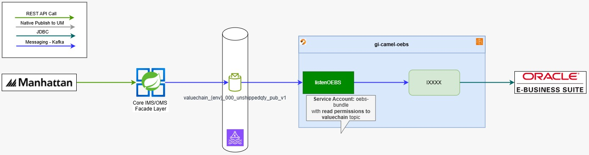

# Day 3 – The Agentic Integration Lifecycle (AILC)

Day 1 set up the tools and your first skill. Day 2 went deeper: modes,
guardrails (permissions, the `.env` hooks), tools and MCP, and a chain of
installed skills. Day 3 puts all of it to work on **an integration's whole
life** — from the request to the alert that fires in production — and shows
how the agent works at each step without taking the decisions that belong
to you.

## Setup
```
cd training/repo/amway-dve
git pull
cd day3
```
Keep the Day 2 guardrails on (the `.env` deny hooks in `settings.json`) —
Stage 6 builds on them.

Everything today runs on one real flow from your architecture:



**Manhattan → Core IMS/OMS facade → `valuechain_{env}_000_unshippedqty_pub_v1`
→ `gi-camel-oebs` (listenOEBS) → IXXXX → Oracle EBS.**

---

## Why integrations need their own lifecycle

Writing the route is the smallest part of an integration. The expensive parts are:

- **Two systems you don't own.** The contract (topic, schema, staging table) matters more than the code.
- **Data is moving.** A message can arrive twice, arrive broken, or never arrive. Replay and error handling are part of the design.
- **Many environments.** `dv`, `ts1–3`, `qa1–2`, `perf`, `pd` — each with its own variables and secrets.
- **It lives for years.** Lag, alerts and runbooks cost more than the build.

---

## The AILC — eight stages

| # | Stage | Agent does | Agent never does | You decide | Evidence |
|---|---|---|---|---|---|
| 1 | **Intake** | Drafts the I-number brief from the request and the diagram, lists open questions | Invents a system, a volume or an owner | Lead | Brief with every field filled or marked OPEN |
| 2 | **Contract** | Drafts topic name, `.proto`, staging table; checks naming and schema compatibility | Registers a schema (`auto.register.schemas` stays `false`) | Principal + producer team | Check output |
| 3 | **Design** | Picks the route template and one of your 6 certified consumer patterns; writes the ADR | Uses an uncertified component | Principal | ADR |
| 4 | **Build** | Writes the bundle: template instance in properties, one `direct:` route in VETO order, Velocity `.vm`, `camel-sql` with `transacted=true` + `batch=true` | Raw `kafka:`/`http:` endpoint, Groovy, DB call inside a split | — | Bundle on a branch |
| 5 | **Verify** | Runs `validate_bundle.py`, mapping tests, replay plan (Pipeline Recorder) | Claims "done" without fresh output | Lead | PASS output |
| 6 | **Promote** | Checks every `{{key}}` exists in every env, no secret in `variables/`, branch flow `staging_dv → staging_ts → staging_qa → main` | Touches `pd` secrets, merges to `main` — enforced with the same kind of hook you built for `.env` on Day 2 | DevOps / apps admin | Env matrix + sign-off |
| 7 | **Operate** | Checks ExceptionEvent alerting (non-prod severity `"3"`), drafts the runbook | Changes production config | Apps admin | Runbook + alert test |
| 8 | **Change** | Finds every consumer before a change | Changes data | Principal | Impact list |

---

## How we build the AILC: Graph + Loops + Subagents + Skills

This is the core idea of the day. Each piece has one job:

| Piece | Job in the AILC | What we use |
|---|---|---|
| **Graph** | *What exists and what is connected.* Topics, bundles, interfaces, docs, owners — so intake (stage 1) and impact analysis (stage 8) start from facts, not memory. | `graphify` over your repos, docs and diagrams |
| **Small loops** | *One stage = one bounded loop with an exit check.* The agent works until a script says PASS, or stops and asks. Never one giant "build me the integration" prompt. | A skill + its check script per stage |
| **Subagents** | *Fresh context per job, run in parallel.* Contract review, promotion check and alerting review run side by side; a gate-reviewer subagent pre-checks the evidence before a human signs. | `.claude/agents/`, `dispatching-parallel-agents` |
| **Skills** | *Your team rules, applied the same way every run.* `camel-integration-author` already does this for stage 4. Today we fill the other stages. | Your GI skills + skills.sh + skills you write today |
| **Gates** | *The human decision.* The agent brings evidence; you approve. | You |

```
                 ┌──────────── GRAPH (what exists) ─────────────┐
                 │                                              │
  request ─▶ [1 Intake]─▶[2 Contract]─▶[3 Design]─▶[4 Build]─▶[5 Verify]─▶[6 Promote]─▶[7 Operate]
               loop+check   loop+check   loop+ADR    loop+check  loop+check  loop+check   loop+runbook
                  │             │            │           │           │           │            │
                 GATE          GATE         GATE          │          GATE        GATE         GATE
                                                          └── subagents review in parallel ──┘
```

---

## Plan for the day

**Part 1 — plan the integration (stages 1–3)**

| Block | Topic |
|---|---|
| 1.1 | Where we are: Day 1–2 recap, today's flow |
| 1.2 | Why integrations need their own lifecycle |
| 1.3 | The AILC, stage by stage |
| 1.4 | How it's built: graph, small loops, subagents, skills, gates |
| 1.5 | Skills: your team already started — and how to vet public ones |
| **Lab 1** | **Plan the flow** — [`assignments/LAB1.md`](assignments/LAB1.md) → signed plan pack |

**Part 2 — build it and prove it (stages 4–7)**

| Block | Topic |
|---|---|
| 2.1 | From plan to build: the agent is only as good as what you give it |
| 2.2 | Build: your standards, and why they exist |
| 2.3 | Test: evidence, not "done" |
| 2.4 | Release: what DevOps needs from you |
| 2.5 | Run: when it breaks at 3 a.m. |
| **Lab 2** | **Greenfield: unshipped quantity** — [`assignments/LAB2.md`](assignments/LAB2.md) → signed `EVIDENCE.md` |
| Close | Show-back and next steps |

## What you leave with

1. An AILC map for your team — stage, agent job, gate owner, evidence.
2. A knowledge graph of your integration material you can query.
3. Three stage skills from this folder, plus one you wrote yourself.
4. A gate-reviewer subagent your leads can use on any bundle.
5. The unshipped-quantity scaffold with evidence for stages 1–6.

## What's in this folder

```
day3/
  README.md               this page
  install-skills.md       public skills to install (skills.sh)
  assignments/
    LAB1.md               plan the flow (stages 1–3)
    LAB2.md               greenfield build and prove (stages 4–7)
  solutions/              reference version of the skill you write in Lab 1
  skills/                 three stage skills written for this flow (copy into .claude/skills/)
    inumber-intake/         stage 1 — brief + check_brief.py
    kafka-topic-contract/   stage 2 — topic name + producer props checks
    env-promotion-check/    stage 6 — every key in every env, no secrets in variables/
  agents/                 gate-reviewer subagent (copy into .claude/agents/)
  lab/                    the unshipped-quantity diagram
```

> Anything marked **OPEN** in these files is a fact only your team can confirm
> (topic naming rule, OEBS staging conventions, IXXXX details). Confirming it
> is part of the work, not a gap in the material.
