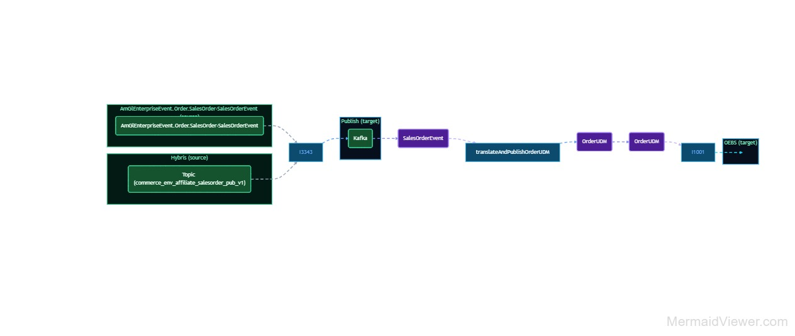
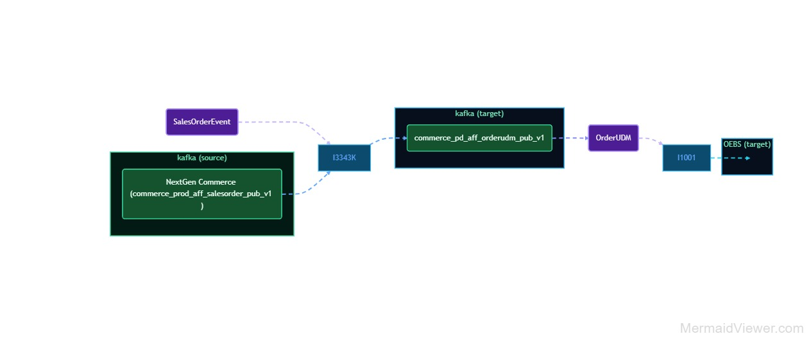

# Day 4 – MCP, agent swarms, and brownfield

## Setup
```
cd training/repo/amway-dve
git pull
cd day4
```

## Plan for the day

| Block | Topic | Material |
|---|---|---|
| 1 | **MCP**: what AI, agents and MCP are; why MCP; the six use cases | Slides + [`../day3/assignments/mcp/`](../day3/assignments/mcp/README.md) |
| 2 | **Agent swarms**: many agents, each with its own tools | Slides |
| 3 | **Brownfield theory**: change what's already running | Slides |
| **Lab 3** | **Move I3343 to I3343K without I1001 noticing** | [`assignments/LAB3.md`](assignments/LAB3.md) |
| Close | Show-back | |

## The brownfield change




The source moves from Hybris to NextGen Commerce and I3343 becomes I3343K.
**What I1001 and OEBS receive must not change.** The agent may change the
structure, never the data — and the **parity check** proves it.

## What's in this folder

```
day4/
  README.md                 this page
  assignments/LAB3.md       the brownfield lab
  lab/                      the two diagrams, the order flow, the change request, the old mapping rules,
                            the NextGen fields, and made-up sample messages
    samples/                hybris-input · nextgen-input · recorded-orderudm (S1–S6)
  skills/parity-check/      old output vs new output; structure may change, data may not
  agents/                   gate reviewer, now with stage 8 (Change) checks
  solutions/i3343k/         reference mapping + signed allowed-differences file
```

> The sample messages and `lab/legacy-i3343-mapping.md` are **made-up training
> data**, not real Amway orders or the real I3343 mapping. Swap in real, cleaned
> messages when you run this on your own flows.
